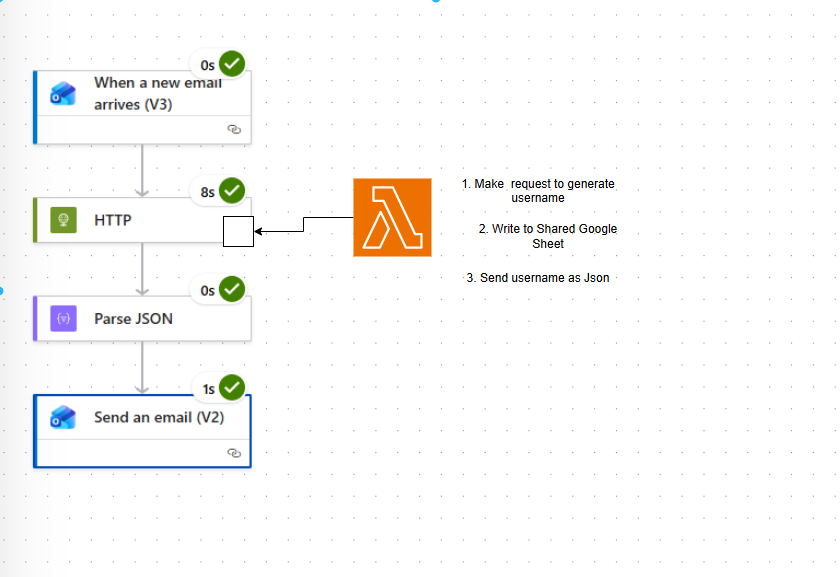

The Prob:

Users of the hackathon should be assigned to teams of three.
This should ideally happen assoon as a user signs up to the event itself. 

Now Luma does events which is great! but webhooks are behind a paywalled api. 

 ~~ needlessly complicated but fun workaround is to leverage a email notifcation being sent when someone registers for an event , ~~ 

 ~~ forward this to mx record pointing to a aws ses smtp endpoint which has an active rule to activate a lambda  ~~ .

 ~~ This lambda pulls from secret manager the Service Account creds needed to access google SHeets api and then ~~  
 ~~  updates it the google sheet of the registered users given name on luma to the randomly generated username. ~~ 

Approach 2: Didnt know about powerautomate a saas tool . can use it to do all the heavy lifting :D . 

prereqs:
-luma account
-aws account
-gcloud account
- ghseet https://docs.google.com/spreadsheets/d/18AkvPdk1GfcPr5Zwq2dmcSNjKVdIX-ltCrk5FAR_cds/edit?gid=0#gid=0